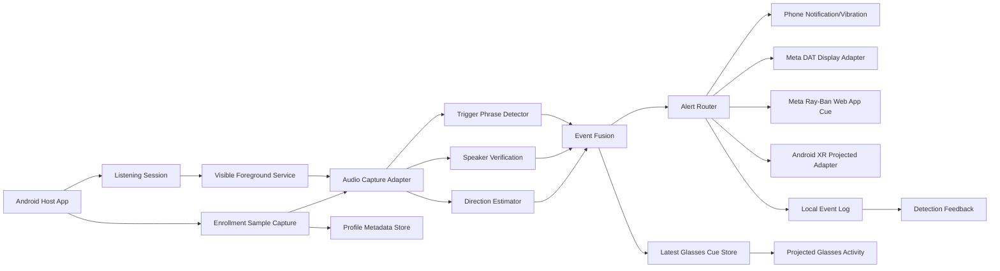

# Technical Architecture

## Architecture Principles

- Local-first: voice profiles and detection should run on device whenever possible.
- Adapter-first: platform-specific glasses APIs stay behind narrow interfaces.
- Explicit session state: listening and glasses access are always visible to the user.
- No raw audio retention by default.
- Direction confidence is part of every result.

## System Components



## Core Domain Models

```kotlin
enum class CallerDirection { FRONT, BACK, LEFT, RIGHT, UNKNOWN }

data class SpeakerProfile(
    val id: String,
    val displayName: String,
    val embeddingRef: String,
    val createdAt: Instant,
    val consentVersion: String,
    val verificationMode: SpeakerVerificationMode,
    val enrollmentStatus: SpeakerEnrollmentStatus,
    val sampleCount: Int
)

data class VoiceEmbedding(
    val values: List<Float>
)

data class DetectionEvent(
    val id: String,
    val speakerProfileId: String?,
    val phraseMatched: Boolean,
    val speakerConfidence: Float,
    val direction: CallerDirection,
    val directionConfidence: Float,
    val sourceAdapter: String,
    val createdAt: Instant
)

data class DetectionFeedback(
    val eventId: String,
    val type: DetectionFeedbackType,
    val createdAtMillis: Long
)

data class FalsePositiveRun(
    val id: String,
    val startedAtMillis: Long,
    val targetDurationMillis: Long,
    val endedAtMillis: Long?
)
```

## Audio Pipeline

Phase 1: Simulator and controlled samples

- Use local test WAV files and manually selected directions.
- Validate UI, event fusion, notifications, and false-positive handling.
- No hardware assumptions.

Phase 2: Phone microphone proof

- Use Android `SpeechRecognizer` for trigger phrase experiments.
- Use `AudioRecord` only in a visible foreground session.
- Measure whether phone microphone data can provide useful left/right estimates.
- Run an `AudioRecord` capability probe first to check sample-rate/channel combinations without reading or storing raw audio.
- If stereo support appears, run a short in-memory `AudioRecord` sample and pass the buffer directly to `StereoPcmDirectionEstimator`; do not persist the PCM.
- Run a Bluetooth communication-device route probe to check whether Android sees Ray-Ban/Android XR glasses as Bluetooth SCO or BLE headset input. This records route metadata only and does not save audio.
- When a Bluetooth input candidate is visible, the host app can request Android to select it as the communication device and later clear the route. This should be used only in observed physical-device tests.
- Debug builds expose `DEBUG_BLUETOOTH_ROUTE_EVIDENCE`, which records communication-routing support, permission booleans, route type counts, Bluetooth input candidate count, and selected type without device/product names.
- Enrollment sample capture uses mono `AudioRecord`, analyzes RMS/peak/clipping in memory, computes a prototype feature embedding, increments a profile sample counter only when quality passes, and does not persist PCM.

Current service baseline:

- `ListeningForegroundService` starts a visible Android foreground service with `foregroundServiceType="microphone"`.
- `MainActivity` only starts the listening service after `RECORD_AUDIO` is granted.
- The foreground notification includes an app-open intent and a stop action.
- One-shot Android speech recognition now feeds the same event fusion and alert path as simulator input.
- The service owns a prototype repeated recognition loop using Android `SpeechRecognizer`.
- The service reads saved profiles and settings from `VoiceDirectionRepository`, evaluates recognized text, stores detection metadata, and emits alert outputs.
- Activity-owned manual evaluation and service-owned automatic evaluation share `AndroidListeningEngineFactory`.
- When the service detects the configured trigger phrase and at least one stored profile has an `embedding:v1:` reference, it now captures one short transient mono sample, computes a prototype live embedding, compares it to stored prototype profile embeddings, and emits alerts only if phrase and prototype voice match both pass.
- After a prototype voice match attempt, the service now tries one short stereo direction sample through `ServiceDirectionResolver`. If a stereo estimate is sampled, it uses that estimate, including `UNKNOWN`; if stereo sampling is unavailable or fails, it falls back to the saved prototype direction setting.
- The service persists a compact `ServiceAutomationBridgeSnapshot` after prototype voice/direction bridge evaluation. The host UI reads it on resume and shows sample status, match status, similarity bucket, direction sample status, whether sampled direction was used, direction enum, and source.
- This service-side prototype voice check still uses a short post-recognition sample window. It is an automation bridge for testing the stored-voice path, not a production speaker verification model.
- The service does not yet run continuous `AudioRecord` capture or real speaker embedding inference.
- Speaker profiles now carry verification mode and enrollment status. Current app-created profiles are explicitly `TRANSCRIPT_LABEL_SIMULATION` and `LABEL_ONLY`.
- `SimulatedSpeakerVerifier` ignores profiles marked for `ON_DEVICE_EMBEDDING`, so future real voice profiles will not be accidentally treated as verified by transcript text.
- `SpeakerVerifier` now receives `SpeakerVerificationInput`, which can carry both transcript text and a future live voice embedding.
- `EmbeddingSpeakerVerifier` can match `MODEL_READY` profiles by cosine similarity against an `embedding:v1:` local embedding reference. It is tested but not yet the default service verifier because live embedding extraction is still missing.
- The repeated `SpeechRecognizer` loop still needs physical device validation because OEM behavior and timeout behavior can vary.
- The host app includes a microphone channel probe that checks `AudioRecord.getMinBufferSize(...)` for mono/stereo at 16 kHz, 44.1 kHz, and 48 kHz.
- The host app includes a short stereo direction sample action that reads one in-memory PCM buffer only when stereo support is reported.
- Direction sample output is classified with an evidence label: left/right usable, low confidence, front/back unproven, or unavailable.
- Debug builds expose `DEBUG_DIRECTION_VALIDATION_TRIAL`, and `scripts/record-direction-validation-trial.sh` wraps it for controlled expected-vs-observed direction trial entry over ADB using only enums, status, confidence, optional sample counts, and allow-listed source labels.
- The host app includes a per-profile voice enrollment sample quality action. It records one short mono PCM buffer in memory, computes quality metrics and a prototype `embedding:v1:` feature vector, discards the samples, and persists only sample count, enrollment status, and averaged embedding reference.
- The host app includes a per-profile prototype voice match diagnostic. It captures a fresh in-memory sample, creates a live prototype embedding, compares it to the stored prototype embedding reference, and reports only a similarity result.
- The foreground service includes the same prototype voice matching path after trigger phrase detection, so accepted enrollment samples can influence automatic service alerts during controlled prototype tests.
- The foreground service includes a short direction-sample bridge after prototype voice matching, so phone hardware that exposes useful stereo PCM can influence the alert direction before glasses SDK work starts.
- The host UI includes a service automation diagnostic card for the latest persisted bridge snapshot.

Phase 3: Glasses hardware proof

- Meta DAT: test whether current DAT/dev mode exposes audio data usable for speaker/direction detection.
- Meta Ray-Ban Web Apps: test display-only cue rendering through a public HTTPS URL without voice, transcript, speaker-name, Bluetooth, location, or token data.
- Android XR: use projected context and Android audio APIs where documented; test whether microphone source/channel information is enough for direction.

## Direction Estimation Strategy

`DirectionEstimator` must support multiple implementations:

- `SimulatedDirectionEstimator`: deterministic test input.
- `SingleMicDirectionEstimator`: returns `UNKNOWN` unless camera/visual context helps.
- `StereoPcmDirectionEstimator`: estimates left/right from two-channel PCM energy balance.
- `AudioDirectionEvidenceClassifier`: labels each sampled estimate with the safe product interpretation before it is shown in the UI.
- `StereoOrArrayDirectionEstimator`: future estimator for left/right/back/front when multi-channel timing/energy data is available.
- `VisionAssistedDirectionEstimator`: if caller face is visible in glasses camera, classify visible direction as likely `FRONT`; otherwise do not guess.

Important: stereo energy can support only rough left/right. Front/back needs stronger evidence than left/right, such as microphone array timing, head pose, or vision context. Avoid presenting fake precision. If confidence is low, the UI should show `unknown` or use a weaker cue. The direction sample summary now makes this explicit with `판정` and `지침` lines.

## Alert Output

Phone:

- Notification with speaker label and direction.
- Vibration pattern by direction.
- Optional TTS for accessibility.
- Direction-only Android TextToSpeech cue for displayless/audio glasses fallback.
- Persisted channel preferences filter phone notification, vibration, TTS, Meta Display, and Android XR Display adapters so tests can isolate each output path.
- A direct alert-output diagnostic emits a generic direction cue through enabled channels without creating a detection event.

Meta Ray-Ban Display:

- Web App display cue prototype for fast 600x600 direction rendering without phone hardware.
- DAT display card/overlay where supported after credentials, logged-in docs, and package access are configured.
- DAT session state handling via `RUNNING`, `PAUSED`, `STOPPED`.
- MockDeviceKit coverage for display and session states.
- iOS DAT is a later companion option because the user's Ray-Ban devices are currently paired to iPhone.

Current Meta Web App cue path:

- `apps/meta-rayban-display-webapp` is a static HTML/CSS/JavaScript app.
- It renders only `FRONT`, `BACK`, `LEFT`, `RIGHT`, or `UNKNOWN`.
- It accepts optional URL parameters for `direction`, `confidence`, and `source`.
- It supports browser arrow-key input that maps to D-pad style direction selection.
- It stores only the latest non-PII cue in browser local storage.
- It does not request microphone, camera, Bluetooth, contacts, location, account, or raw sensor permissions.
- It does not prove actual Ray-Ban Display runtime behavior until deployed to HTTPS and added through the Meta AI app on real hardware.

Android XR:

- Projected `GlassesMainActivity` with `android:requiredDisplayCategory="xr_projected"`.
- Compose Glimmer directional cue.
- TTS fallback when display is unavailable/off.

Current projected cue path:

- `GlassesCueSnapshot` stores the latest actionable cue metadata: speaker label, direction, confidence, and timestamp.
- `MainActivity` and `ListeningForegroundService` save the latest cue whenever a detection event is actionable.
- `GlassesProjectedActivity` reads `latestGlassesCue` from `VoiceDirectionRepository` on create/resume and renders it with `GlassesCueScreen`.
- `GlassesCuePayload` is the shared contract for projected display and future Meta DAT/Android XR adapters. It keeps display fields separate from the non-PII `evidenceSummary`, so speaker labels can appear on glasses UI without being echoed into logs or generated evidence.
- Debug builds expose `DEBUG_GLASSES_CUE_SEED`, which stores a generic latest cue before projected launch so ADB smoke evidence can prove the state handoff without recording any speaker label.
- This proves app-level state handoff to the projected screen; it does not prove real Android XR display launch or Meta Display rendering until device testing.
- `GlassesIntegrationReadiness` records the current glasses-alpha blockers in code, and the host app shows them in the `글래스 연동 준비` card.

Haptics:

- Keep `HapticOutputAdapter` as an interface only until an official per-side haptic API is confirmed.
- Use phone vibration in MVP.

## Storage

Local encrypted storage:

- Speaker embeddings.
- Consent records.
- Settings.
- Detection event metadata.

Do not store by default:

- Raw audio.
- Full transcripts.
- Exact GPS.
- Contact lists.

Optional backend later:

- Auth and paid subscription.
- Opt-in encrypted profile backup.
- Crash reports and PII-safe telemetry.
- Tester release metadata.

## Initial App Folder Plan

```text
apps/voice-direction-glass/
  app/src/main/kotlin/com/voicedirection/glass/
    audio/
    detection/
    direction/
    alerts/
    adapters/meta/
    adapters/androidxr/
    storage/
    ui/
  test/
  docs/
```

## Current Scaffold

The first Android scaffold now exists at `apps/voice-direction-glass`.

Implemented:

- Compose host app shell.
- Runtime permission request shell for audio, notifications, and Bluetooth connection.
- Foreground microphone service shell with persistent notification and stop action.
- Service-owned repeated speech recognition prototype.
- Shared Android listening engine factory for Activity and Service flows.
- Simulated trigger phrase and speaker verification.
- Speaker profile verification/enrollment state model with legacy storage decode support.
- Voice embedding value object, local embedding-ref codec, and cosine-similarity `EmbeddingSpeakerVerifier` with unit tests.
- Simulated direction estimator.
- Stereo PCM left/right direction estimator with unit tests.
- AudioRecord capability probe and summary formatter.
- In-memory stereo AudioRecord direction sampler and summary formatter.
- Direction validation trial model and host UI for expected-vs-observed front/back/left/right evidence, including 20-per-direction target progress, without PCM persistence.
- Bluetooth communication-device route probe, route selection/clear controls, summary formatter, and non-PII evidence formatter for HFP fallback checks.
- In-memory voice enrollment sample analyzer, Android sampler, summary formatter, and profile sample-count update path.
- Prototype voice embedding extractor that reduces enrollment PCM to a fixed-width feature vector without storing raw samples.
- Prototype voice match checker and summary formatter for comparing a live sample embedding against a stored profile embedding reference.
- Prototype voice session engine for service-owned trigger phrase plus live prototype embedding verification.
- Phone notification and phone vibration output adapters.
- Android TextToSpeech alert adapter that speaks short direction-only cues and avoids speaker names.
- Local profile and detection event repository.
- Persisted trigger phrase and simulator direction settings for service-owned detection.
- Latest glasses cue storage and projected cue screen.
- Direction validation trial storage and summary for physical phone/glasses evidence.
- Detection feedback storage and UI controls for accurate, false-positive, wrong-direction, and wrong-speaker outcomes.
- False-positive run session storage and UI summary for 30-minute room tests.
- Local data delete flow.
- Android `SpeechRecognizer` one-shot controller.
- Automatic detection evaluation after one-shot speech recognition returns a transcript.
- Meta DAT and Android XR projected display stub adapters.
- Pure unit-test targets for phrase detection, direction fallback, vibration mapping, and session event fusion.
- AndroidKeyStore AES-GCM secure string storage wrapper for profiles, events, settings, latest cue snapshots, and service bridge snapshots, with read-only legacy plaintext migration.

Pending:

- Raw continuous microphone capture inside the foreground service.
- Continuous `AudioRecord` capture inside the foreground service.
- Device verification that the in-memory direction sampler returns useful results before promoting it into the always-on service path.
- On-device speaker embedding model.
- Physical-device proof for AndroidKeyStore encrypted storage migration and restart behavior.
- Production-grade embedding model generation from accepted enrollment samples.
- Runtime live-embedding extraction and service integration for `EmbeddingSpeakerVerifier`.
- Replacement of the post-recognition prototype sample bridge with a measured real-time model/audio pipeline.
- Promotion rules that decide when prototype match evidence is strong enough to test a production-grade model.
- Real Meta DAT session/display integration.
- Real Android XR `ProjectedContext`, Compose Glimmer styling, and hardware launch verification.
- Real device install and interaction verification.

## Storage Implementation Status

Current implementation:

- `PreferencesVoiceDirectionRepository` stores enrolled speaker labels, simulated/prototype embedding refs, trigger phrase settings, simulated direction settings, latest glasses cue metadata, service bridge snapshots, detection metadata, detection feedback, and false-positive run state as encrypted string payloads in app-private `SharedPreferences`.
- `AndroidKeyStoreStringCipher` creates an app-local AES-GCM key in Android Keystore and stores values as `enc:v1:` envelopes.
- Existing plaintext preference keys are still read as a migration fallback only when no encrypted value exists. New writes remove the plaintext key.
- Local profile storage now supports both legacy 5-field speaker profiles and the newer verification-mode/enrollment-status/sample-count profile format.
- `clearAll()` deletes local profiles and event history.
- Debug builds expose `DEBUG_LOCAL_DELETE_SELF_CHECK`, which seeds and clears a separate encrypted debug repository to prove delete semantics without deleting tester data.
- Raw audio is not stored.

Production requirement:

- Run a physical-device encrypted-storage proof before any external beta that uses real voice profiles.
- Keep voice embeddings local unless the user explicitly enables encrypted backup.
